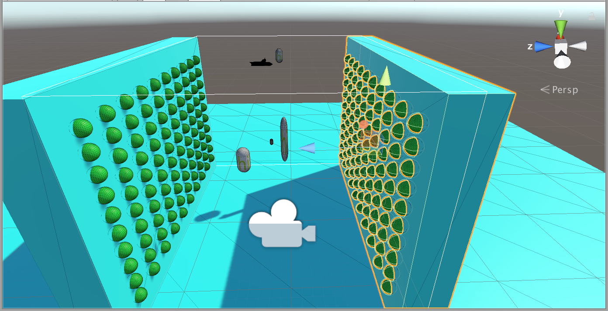
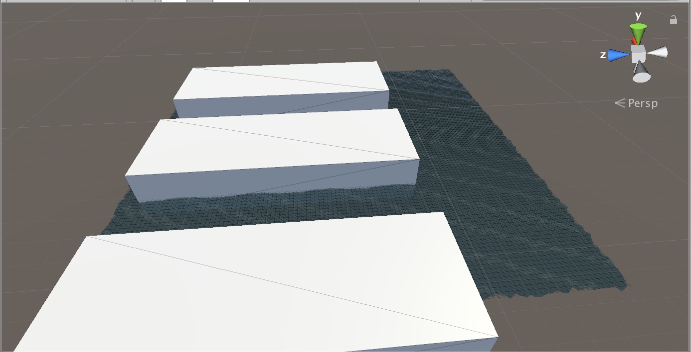
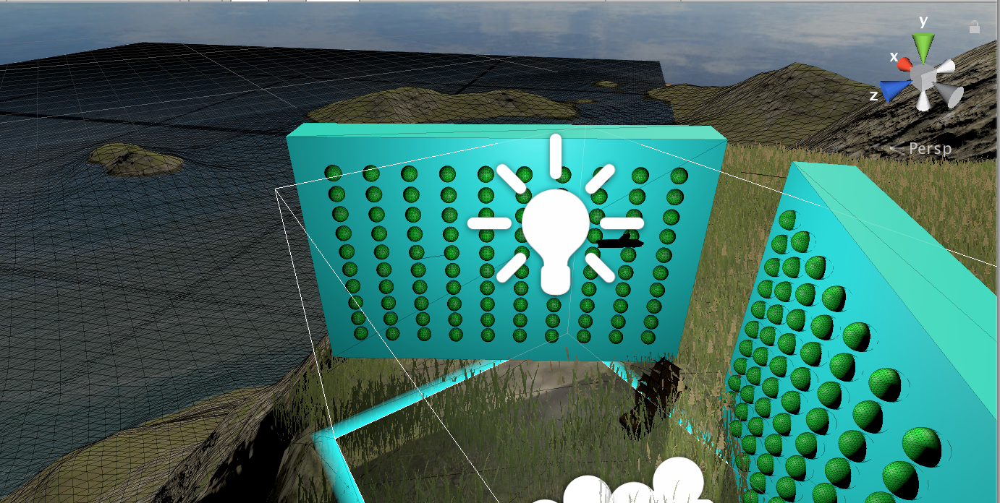
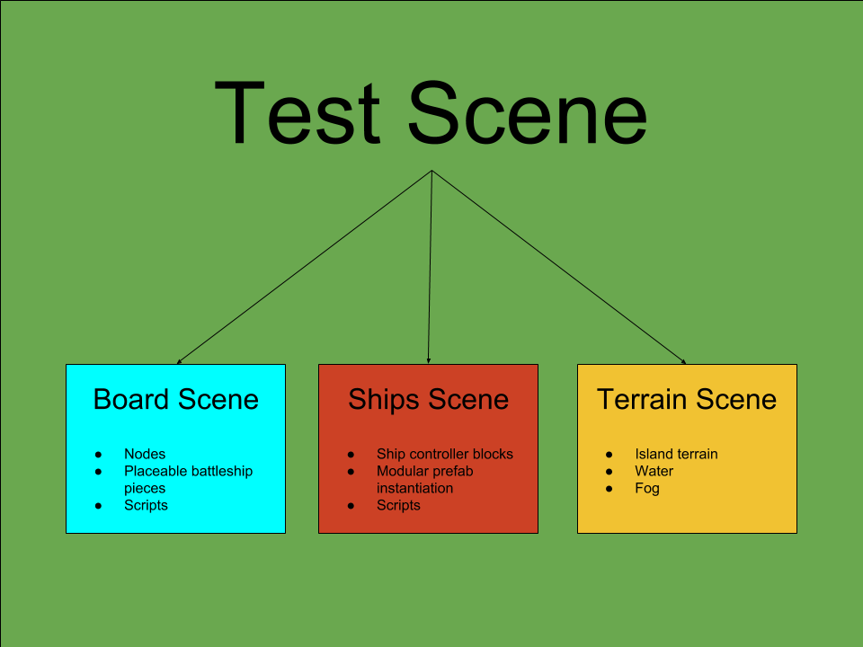
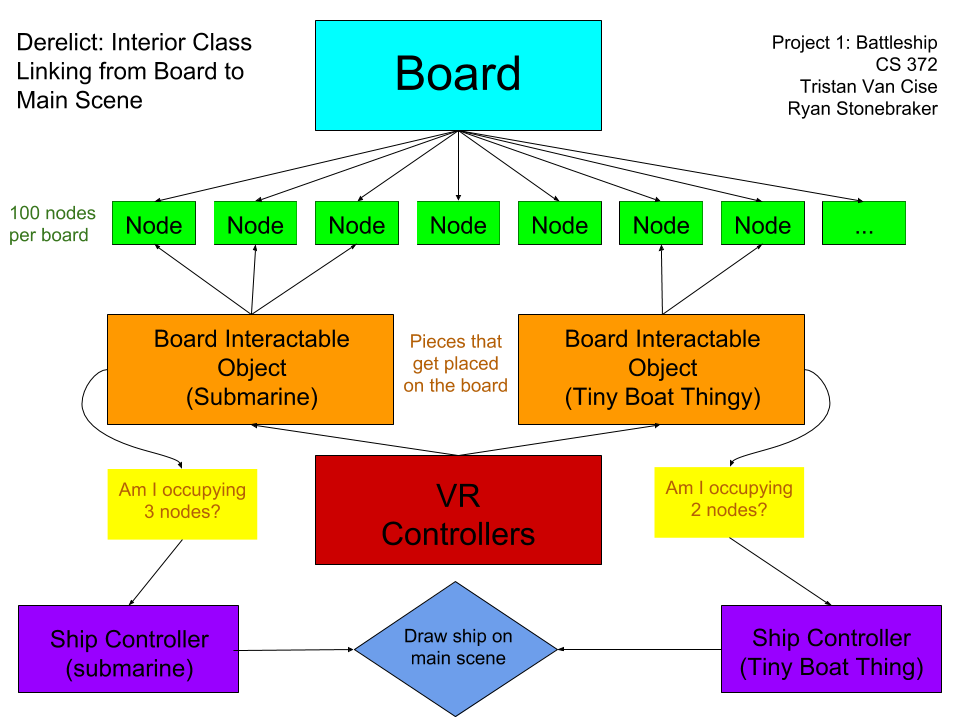

```
██████╗ ███████╗██████╗ ███████╗██╗     ██╗ ██████╗████████╗
██╔══██╗██╔════╝██╔══██╗██╔════╝██║     ██║██╔════╝╚══██╔══╝
██║  ██║█████╗  ██████╔╝█████╗  ██║     ██║██║        ██║   
██║  ██║██╔══╝  ██╔══██╗██╔══╝  ██║     ██║██║        ██║   
██████╔╝███████╗██║  ██║███████╗███████╗██║╚██████╗   ██║   
╚═════╝ ╚══════╝╚═╝  ╚═╝╚══════╝╚══════╝╚═╝ ╚═════╝   ╚═╝   
```                                                            


A virtual reality battleship game.

[](https://youtu.be/pcQfRWxC5eY)

## Getting Started

Derelict is an MIT licensed Battleship game developed for virtual reality using Unity and SteamVR. It has been tested to work on both the Oculus Rift and HTC Vive. Currently, playing is restricted to the developer release only and the below developer instructions must be followed to test out the current build. When more gameplay has been added in the future, release candidate builds will be created for easier use.

## Prerequisites

### Developers
* Unity
* Unity supported IDE (VS 2017 works)
* Oculus Rift or HTC Vive (Cross Compatible)
* Computer capable of handling VR and graphics rendering
* SteamVR (and Oculus software if applicable) 
* 5ft x 5ft empty room

### Users
* Oculus Rift or HTC Vive
* Computer capable of handling VR
* SteamVR
* 5ft x 5ft empty room

## Installing

### Developers
1. Install the following:
	* Unity
	* SteamVR
	* Setup HTC Vive or Oculus Rift if you haven’t already
2. Clone the [repository](www.https://github.com/RyanStonebraker/Derelict)
3. Load the scene located at: Derelict/Assets/WaterFront/WaterFront.unity 
4. Launch SteamVR (ensure all VR components and green and functional)
5. Press the ‘play’ button in the upper center of Unity’s interface
6. Pick up an object with the index trigger
7. Spawn an object using the grip button on the left controller
8. Done! Edit scripts and add things to your heart’s desire!

### Users
1. Install SteamVR
2. Run the setup software for the HTC Vive or Oculus Rift
3. Download Derelict (release build coming soon)
4. Launch Derelict and select graphics settings
5. Hit play and enjoy!

## Testing

Currently, testing is constrained to three scenes. The “board” scene serves as a testing environment for the master board class. The “ships” scene works to test the ship controller placement in a scaled down environment. Finally, the “waterfront” scene currently acts as an interactive testing environment for full game play. In the sense of a more traditional coding project, the board and ships scenes could serve as units tests and the waterfront scene could be likened to integration testing.

### Board Scene

The board scene allows for quick object snapping tests, grabbing/placement, and piece testing. Many features involving node interaction with users and internal backend features are modified and accessed via the various board object scripting mechanics. The primary structural breakdown of the board consists of its rectangular base, circular nodes, and specially marked interactable objects (like battleship pieces or shot markers). 

### Ships Scene

The ships scene makes it easy to test out new ship models by dynamically spawning ships to the board. Furthermore, this is the fastest way to test out features of the Ship Controller class that automatically snaps the ships to a dynamic “grid”.

### Waterfront Scene

The waterfront scene is a cumulative interactive test. This scene is most akin to real gameplay and allows for quick interaction with the board, actual environment, and the ships. If this scene compiles, ships can be placed on the board, and can live update ship position on the water, then no changes broke the code base.

### Testing Layout


Individual tests: Board, Ships, and Terrain Scenes

Collective test: Test Scene (A.K.A Waterfront)

### Running the Test
Unlike traditional languages and projects that support test driven development, C# and Unity offer no obvious frameworks to fulfil those needs. In place of this, we use the Waterfront Scene as our “test environment” and run a series of requirements to ensure changes we make in scripts do not change the expected output. Our development phase is greatly centered on pair programming. Fundamental aspects of the game were planned out, as a group, in blocks before development began. These blocks are terrain, testing, board, ship spawning, and web/multiplayer. Each main topic is separated into its own scene, for example, the board has its own scene where changes are made to scripts and visual appearance, while the ship spawning topic has a completely different scene,  independant of the board. The testing scene (now named Waterfront) combines all the individual scenes together and serves as a testing environment purposed with ensuring everything works together as a unit; further independent testing is done within the individual scenes. By using prefabs, changes made to individual scenes are automatically updated in the testing scene, meaning if a feature is added to an individual scene that brakes the interactions with the other scenes, we know about it and can fix it. Such a testing scheme is not ideal, however, it is current the best means for testing VR since there is no VR simulator that can test applications without a VR headset and controllers. 

## Program Flow

### Interior Class Linking from Board to Main Scene


## Deployment

As of current, there are no precompiled versions of Derelict. In order to run Derelict on your virtual reality system, you must have Unity set up and configured to the repository as a working directory. Once this is done, you can simply press play to enter the current developer edition release. In the future, releases will be shipped in a separate folder in the repository for mainstream game play.

## Built With

* [Unity](https://unity3d.com/) - The 3d physics engine
* [C#](https://docs.microsoft.com/en-us/dotnet/csharp//) - Scripting language used
* [SteamVR](http://store.steampowered.com/steamvr) - Cross Platform VR controller

## Commit Messages
> After reading [How to Write a Git Commit Message by Chris Beams](https://chris.beams.io/posts/git-commit/),
> we adopted a title-subject commit message scheme. While most of
> what was stated in that article is extremely useful, it will take
> time to get used to, especially using the imperative tense.
>
> Commit messages of this style were implemented starting on 02/18/18

## Authors
* **[Ryan Stonebraker](https://github.com/RyanStonebraker)**
* **[Tristan Van Cise](https://github.com/grubbly)**

[Author Journal Entries](JournalEntries.md)

## License

This project is licensed under the MIT License - see the [LICENSE](LICENSE) file for details.

## Acknowledgments

* [PurpleBooth](https://gist.github.com/PurpleBooth/109311bb0361f32d87a2) for README template
* [Chris Beams](https://chris.beams.io/posts/git-commit/) for commit message styling
* [Bicameral Studios](http://u3d.as/10vg) for island terrain inspiration
* [LemonSpawn](http://u3d.as/cCa) for fog shader
* [Bertrum](https://www.turbosquid.com/Search/Artists/Bertrum) for Landing Craft 3d model
* [gofree33](https://www.turbosquid.com/Search/Artists/gofree33) for Nautilus Submarine 3d model
* [jhthomas512](https://www.turbosquid.com/Search/Artists/jhthomas512) for the American Warship 3d model

